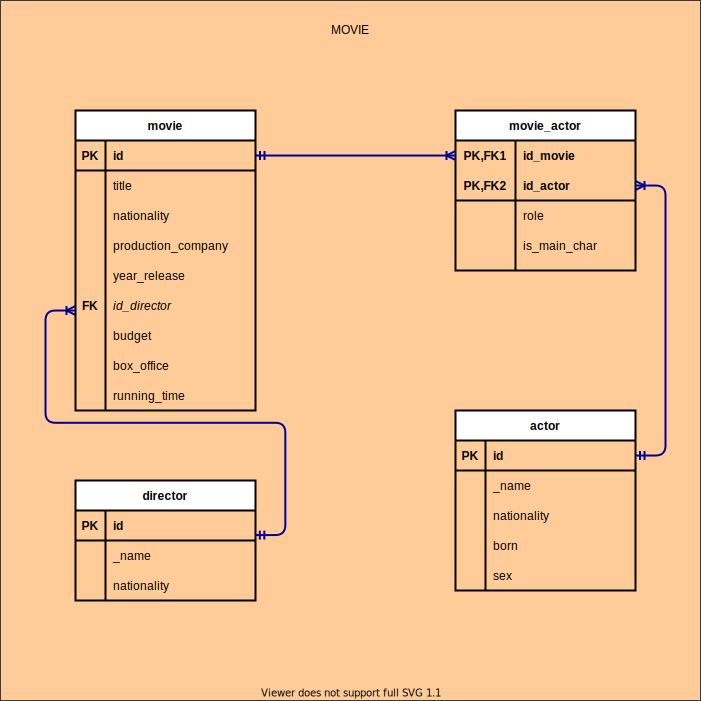

# Description

This folder stores all the Entity Relation models for the database management and its data structure.

## ER List

1. [Movie](###movie)
2. Series
3. User
4. API Movie
5. API Series
6. API User

**Remark:** At this moment only _movie ER_ is build, hence, _I will be creating each ER just before I'm up to use it_.

## Entity Relations

### Movie
